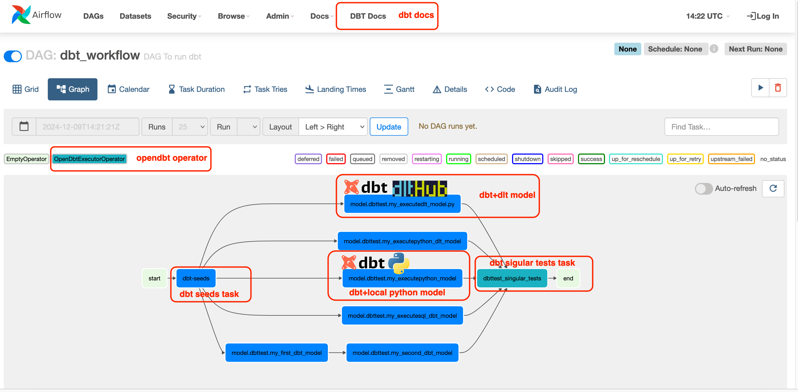

[](http://www.apache.org/licenses/LICENSE-2.0.html)


# opendbt

This project adds new capabilities to dbt-core by dynamically extending dbt's source code.
dbt is a popular solution for batch data processing in data analytics. While it operates on
an [open-core model](https://opencoreventures.com/blog/2023-07-open-core-is-misunderstood-business-model/), which can
sometimes limit the inclusion of community features in the open-source version. no worries opendbt is here to solve it.
opendbt offers a fully open-source package to address these concerns. **OpenDBT builds upon dbt-core, adding valuable
features without changing dbt-core code.**

`opendbt` unlocks many customization which are not in dbt-core, allowing end user to tailor dbt to his/her specific
needs and data workflows.

With `opendbt` you can go beyond the core functionalities of dbt. For example seamlessly integrating your customized
adapter and providing jinja context with further adapter/python methods.

# Features

- Customize Existing Adapters: Leverage OOP to create custom adapters that extends existing ones. With this user
  could provide more python features to jinja
- Execute Local Python Code: Use dbt Python models
  to [run local Python code](https://medium.com/@ismail-simsek/make-dbt-great-again-ec34f3b661f5). For example, you
  could import data from web APIs directly within your dbt model.
- Integrate [DLT](https://dlthub.com/) to dbt framework. Run end to end ETL pipeline with dbt
  using [dlt extract and load](https://dlthub.com/) [integration](https://github.com/memiiso/opendbt/issues/40). Use DBT
  to implement full ETL pipeline, including extract and loads
- Use multi project dbt-mesh setup,
  using [cross-project references](https://docs.getdbt.com/docs/collaborate/govern/project-dependencies#how-to-write-cross-project-ref).
  ex: `{{ ref('jaffle_finance', 'monthly_revenue') }}`
  - This feature was only available in "dbt Cloud Enterprise" so far.
- Granular Model-Level Orchestration with Airflow: Integrate Airflow for fine-grained control over model execution.
- Serve dbt Docs in Airflow UI: Create a custom page on the Airflow server that displays dbt documentation as an Airflow
  UI page.
- Customized dbt Docs: Replace the default dbt documentation page with your own custom index.html file.
- Register [dbt callbacks](https://docs.getdbt.com/reference/programmatic-invocations#registering-callbacks) within a
  dbt project to trigger custom actions or alerts based on selected dbt events.

For detailed examples, see: [examples](docs/EXAMPLES.md).



## Installation

install version from github:

```shell
pip install https://github.com/memiiso/opendbt/archive/refs/tags/0.4.0.zip --upgrade --user
```

## **Your Contributions Matter**

The project completely open-source, using the Apache 2.0 license.
opendbt still is a young project and there are things to improve.
Please feel free to test it, give feedback, open feature requests or send pull requests.

### Contributors

<a href="https://github.com/memiiso/opendbt/graphs/contributors">
  
</a>
