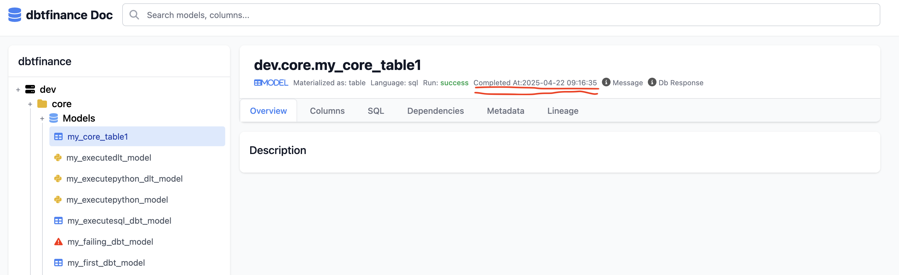
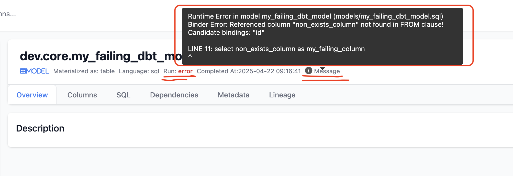
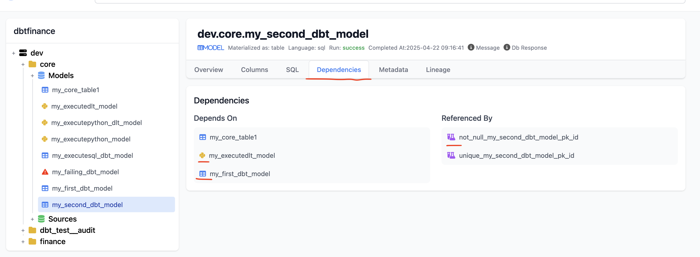
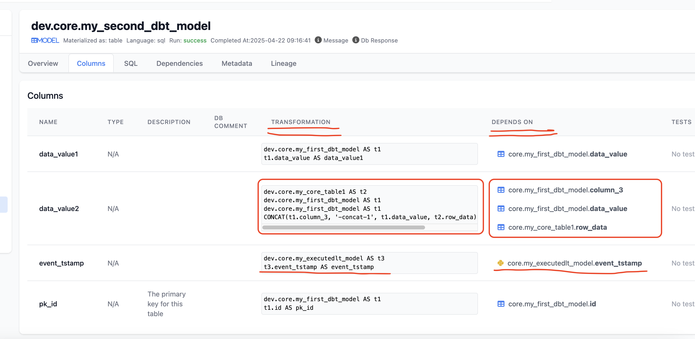
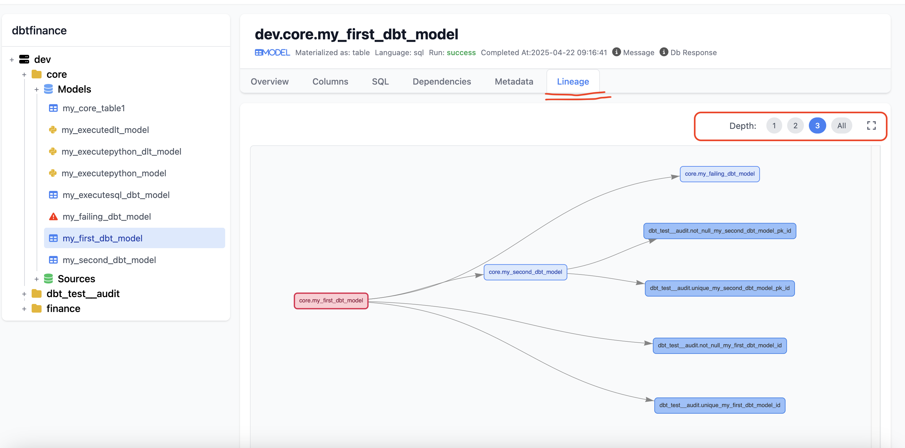

# Opendbt Catalog

[See it in action](https://memiiso.github.io/opendbt/opendbtdocs/)

Summary of the catalog files:

- [catalog.json](catalog.json): Generated by dbt
- [catalogl.json](catalogl.json): Generated by opendbt contains extended catalog information with column level lineage
- [manifest.json](manifest.json): Generated by dbt
- [run_info.json](run_info.json): Generated by opendbt, contains latest run information per object/model

## Key Features

### Up to date Run information

### Run information with error messages

### Model dependencies including tests

### Column level dependency lineage, transformation

### Dependency lineage

