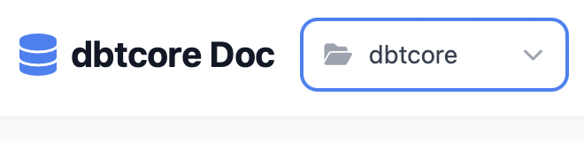
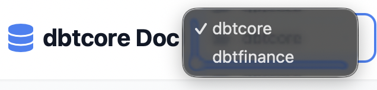

# Opendbt Catalog

[See it in action](https://memiiso.github.io/opendbt/opendbtdocs/)

## Generating the Enhanced Catalog

To generate the enhanced catalog UI with column-level lineage, use the opendbt CLI:

```bash
python -m opendbt docs generate
```

This command will:
- Generate standard dbt catalog files (`catalog.json`, `manifest.json`)
- Generate `catalogl.json` with column-level lineage information
- Deploy the enhanced catalog UI to your target directory

**Important:** Using the standard `dbt docs generate` command will generate only the basic dbt documentation without the enhanced UI and `catalogl.json` file.

## Customizing the Catalog UI

You can override the default enhanced UI with your own custom `index.html` by placing it in your dbt project's `docs` directory:

1. Create a `docs` folder in your dbt project root (if it doesn't exist)
2. Add your custom `index.html` to this folder
3. Ensure `dbt_project.yml` includes the docs path:
   ```yaml
   docs-paths: ["docs"]
   ```
4. Run `python -m opendbt docs generate`

The priority order is:
1. User-provided `index.html` from `docs-paths` (highest priority)
2. Opendbt's enhanced catalog UI (automatic fallback)
3. Standard dbt-generated UI (only if using `dbt docs generate`)

## Airflow Integration

### Configuration

The plugin auto-detects single/multi-project mode. If Airflow Variable `opendbt_docs_projects` is set, it overrides paths in the code.

#### Using Airflow Variable

```bash
# Single project
airflow variables set opendbt_docs_projects '"/opt/dbtcore/target"'

# Multiple projects
airflow variables set opendbt_docs_projects '["/opt/dbtcore/target", "/opt/dbtfinance/target"]'
```

#### Using hardcoded paths

```python
from pathlib import Path
from opendbt.airflow import plugin

# Single project
airflow_dbtdocs_page = plugin.init_plugins_dbtdocs_page(
    Path('/opt/dbtcore/target')
)

# Multiple projects
airflow_dbtdocs_page = plugin.init_plugins_dbtdocs_page([
    Path('/opt/dbtcore/target'),
    Path('/opt/dbtfinance/target')
])
```

Project names are extracted from parent directory (e.g., `/opt/dbtcore/target` → `dbtcore`).

Access docs at `/dbt/dbt_docs_index.html`. For multiple projects, use `?project=<name>` or the dropdown selector.

## Catalog Files Summary

- [catalog.json](catalog.json): Generated by dbt
- [catalogl.json](catalogl.json): Generated by opendbt contains extended catalog information with column level lineage
- [manifest.json](manifest.json): Generated by dbt
- [run_info.json](run_info.json): Generated by opendbt, contains latest run information per object/model

## Key Features

### Up to date Run information


### Run information with error messages


### Model dependencies including tests


### Column level dependency lineage, transformation


### Dependency lineage


### Multi-project support



